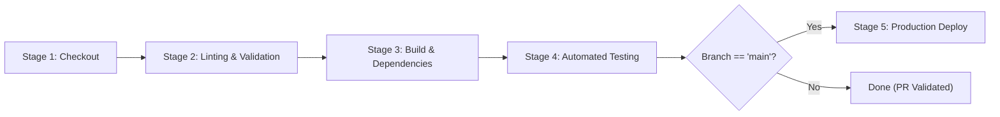

# Medicine Stock System (Medical Stock System)

An end-to-end Flask & MySQL inventory management system with a full collaborative Git workflow and automated Jenkins CI/CD pipeline.

---

## 📋 Table of Contents
- [Architecture & Tech Stack](#architecture--tech-stack)
- [Collaborative Git Workflow](#collaborative-git-workflow)
- [Feature Branching Strategy](#feature-branching-strategy)
- [Pull Request & Code Review Process](#pull-request--code-review-process)
- [Jenkins CI/CD Pipeline](#jenkins-cicd-pipeline)
- [GitHub Webhook & Branch Protection](#github-webhook--branch-protection)
- [Local Setup & Deployment](#local-setup--deployment)
- [Pipeline Verification & Troubleshooting](#pipeline-verification--troubleshooting)

---

## 🏗️ Architecture & Tech Stack

* **Backend:** Python 3.10+ / Flask
* **Database:** MySQL 8.0 (Relational schema with suppliers, medicines, users, sales)
* **Frontend:** Jinja2 Templates, HTML5, CSS3, JavaScript
* **WSGI Server:** Gunicorn (Production)
* **Containerization:** Docker & Docker Compose
* **Testing & Quality:** Pytest, Flake8, Coverage
* **CI/CD:** Jenkins Declarative Pipeline (Multi-OS support)
* **VCS:** GitHub

---

## 👥 Collaborative Git Workflow

### 1. Adding Collaborators
Repository Owner invites teammates:
1. Navigate to **Settings** $\rightarrow$ **Collaborators**.
2. Click **Add people** and enter the collaborator's GitHub username.
3. Collaborators accept the email invitation or visit:
   `https://github.com/rpriyaphebecse2405h7-crypto/medical-stock-system/invitations`

### 2. Cloning the Repository
Each team member clones their own local working copy:
```bash
git clone https://github.com/rpriyaphebecse2405h7-crypto/medical-stock-system.git
cd medical-stock-system
```

---

## 🌿 Feature Branching Strategy

Our team uses **GitHub Flow** with feature branches. Direct commits to `main` are restricted.

| Branch | Purpose | Example |
| :--- | :--- | :--- |
| `main` | Production-ready, deployable code only | `origin/main` |
| `feature/<name>` | New functionality developed by individual team members | `feature/billing-invoice`, `feature/stock-alerts` |
| `bugfix/<name>` | Bug resolutions and hotfixes | `bugfix/login-session-timeout` |

### Step-by-Step Developer Workflow:
1. **Pull the latest `main`:**
   ```bash
   git checkout main
   git pull origin main
   ```
2. **Create and switch to your feature branch:**
   ```bash
   git checkout -b feature/<feature-name>
   ```
3. **Make your changes, test locally, and commit with clear messages:**
   ```bash
   git add .
   git commit -m "feat(billing): add PDF receipt generator"
   ```
4. **Push your feature branch to GitHub:**
   ```bash
   git push -u origin feature/<feature-name>
   ```

---

## 🔍 Pull Request & Code Review Process

1. Go to [Pull Requests](https://github.com/rpriyaphebecse2405h7-crypto/medical-stock-system/pulls).
2. Click **New Pull Request**.
3. Set `base: main` and `compare: feature/<feature-name>`.
4. Provide a clear description:
   - **Summary of changes**
   - **Screenshots or testing output**
   - **Checklist of completed items**
5. Request a review from at least one teammate.
6. The reviewer inspects files changed, adds comments, and clicks **Approve**.
7. Once tests pass and approval is granted, click **Merge pull request** $\rightarrow$ **Confirm merge**.

---

## ⚙️ Jenkins CI/CD Pipeline

The included [`Jenkinsfile`](./Jenkinsfile) automatically executes upon every push or PR:



### Pipeline Stages:
1. **Checkout:** Clones the targeted commit from GitHub SCM.
2. **Code Validation & Linting:** Runs Python syntax verification (`py_compile`) and `flake8` static analysis.
3. **Build & Dependencies:** Prepares a virtual environment and installs production & test dependencies.
4. **Automated Tests:** Executes `pytest` test suite with JUnit XML reporting (`reports/test-results.xml`).
5. **Deploy:** Conditionally runs only on merges to `main`. Starts containerized or WSGI production services and validates HTTP health.

---

## 🔒 GitHub Webhook & Branch Protection Setup

### 1. Configure Branch Protection (Protect `main`)
1. On GitHub, go to **Settings** $\rightarrow$ **Branches**.
2. Click **Add branch protection rule**.
3. Pattern name: `main`.
4. Enable:
   - [x] **Require a pull request before merging**
   - [x] **Require approvals** (minimum 1 approval)
   - [x] **Dismiss stale pull request approvals when new commits are pushed**
   - [x] **Do not allow bypassing the above settings**
5. Click **Create** / **Save changes**.

### 2. Configure GitHub Webhook for Jenkins
1. Go to repository **Settings** $\rightarrow$ **Webhooks** $\rightarrow$ **Add webhook**.
2. **Payload URL:** `http://<YOUR_JENKINS_SERVER>:8080/github-webhook/`
3. **Content type:** `application/json`
4. **Events:** Select *"Let me select individual events"* $\rightarrow$ check **Pushes** and **Pull requests**.
5. Click **Add webhook**.

---

## 🚀 Local Setup & Deployment

### Quick Run with Docker Compose:
```bash
docker compose up -d --build
```
Access the application at `http://localhost:5000/`.

### Manual Local Run:
1. Create and activate virtual environment:
   ```bash
   python -m venv venv
   source venv/bin/activate  # On Windows: .\venv\Scripts\Activate.ps1
   ```
2. Install dependencies:
   ```bash
   pip install -r requirements.txt
   pip install -r requirements-dev.txt
   ```
3. Set environment configuration:
   ```bash
   cp .env.example .env
   # Edit .env with your local MySQL password
   ```
4. Run tests:
   ```bash
   pytest tests/ -v
   ```
5. Run development server:
   ```bash
   python app.py
   ```

---

## 👥 Contributors

* **Priya** ([@rpriyaphebecse2405h7-crypto](https://github.com/rpriyaphebecse2405h7-crypto)) - Medicine Stock & Billing Features
* **Tejasree** ([@tejasree2405j7](https://github.com/tejasree2405j7) · `ttejasree_cse2405j7@mgit.ac.in`) - Branching, collaborative workflow, and QA testing contribution
*                    ~THANK YOU~
